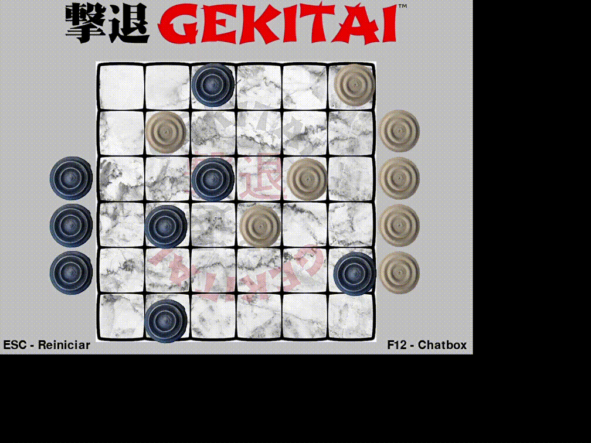
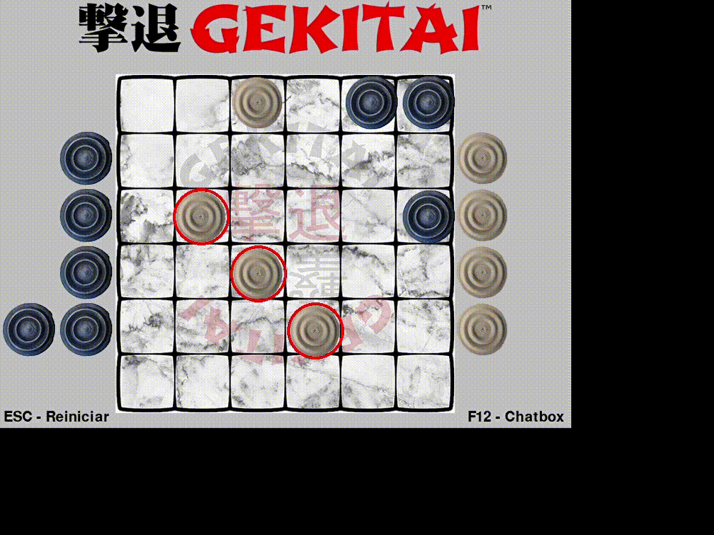

#  Projeto RMI/RPC
## 1) Objetivo: Implementar o Jogo *Gekitai* com  RMI (Remote Method Invocation)
Gekitai, traduzido do Japonês significa repelir, e as peças ao serem colocadas vão repelindo
ou empurrando outras peças que já estão no tabuleiro. O tabuleiro é quadrado com 6 linhas
e 6 colunas, ou seja, são 36 casas. Um jogo para dois jogadores e cada um tem 8 peças.
### Objetivo do jogo
Colocar três peças alinhadas em qualquer direção (depois de realizar os “empurrões” ou
deixar as oito peças de um mesmo jogador no tabuleiro.
### Regras
Cada jogador joga uma peça no tabuleiro de forma intercalada. Ao posicionar uma peça, a
mesmo “empurra” outras peças que estão nas casas ao redor, inclusive as do próprio
jogador. Não se pode empurrar duas ou mais peças alinhadas. Ao empurrar uma peça e essa
sair do tabuleiro, a mesma retorna ao jogador.
## 2) Funcionalidades Básicas
- [x] Controle de turno, com definição de quem inicia a partida
- [x] Movimentação de peças do tabuleiro
- [ ] Desistência
- [x] Chat para comunicação durante toda a partida
## 3) Implementação 
- Esse jogo foi escrito em Python com a biblioteca Pyro4 <http://pypi.python.org/pypi/Pyro4/> e a biblioteca Pygame <https://www.pygame.org> 
- Pyro4 é uma biblioteca que permite construir aplicações nas quais os objetos podem se comunicar entre si pela rede, com mínimo esforço de programação.
- Pygame é uma biblioteca de jogos multiplataforma feita para ser utilizada em conjunto com a linguagem de programação Python
- Pygame e Pyro4 não são bibliotecas nativas do python precisam ser instaladas:
`python -m pip install -U pygame`    
`pip install Pyro4`
- Foi utilizado um servidor de nomes que deve ser inicializado digitando
`python -m Pyro4.naming [opicional]` ou `pyro4-ns [opicional]`em um teminal a parte.
- Cada jogador alterna sua vez de jogar onde ele posiciona sua peça no tabuleiro em um espaço vazio quando possuem peças.
- O *"empurrar"* é feito de forma altomatica.

- Uma vitória é atingida quando o jogador consegue alinhar três de suas peças em qualquer direção ou quando todas suas peças estão no tabuleiro
- Após a uma vitória o jogo pode ser reiniciado pressionando a tecla ESC por qualquer um dos jogadores.
- A tecla F12 ativa e desativa o chat.

- O jogador cliente ao fechar a janela, o servidor é avisado da desistência e inicia uma nova conexão.
